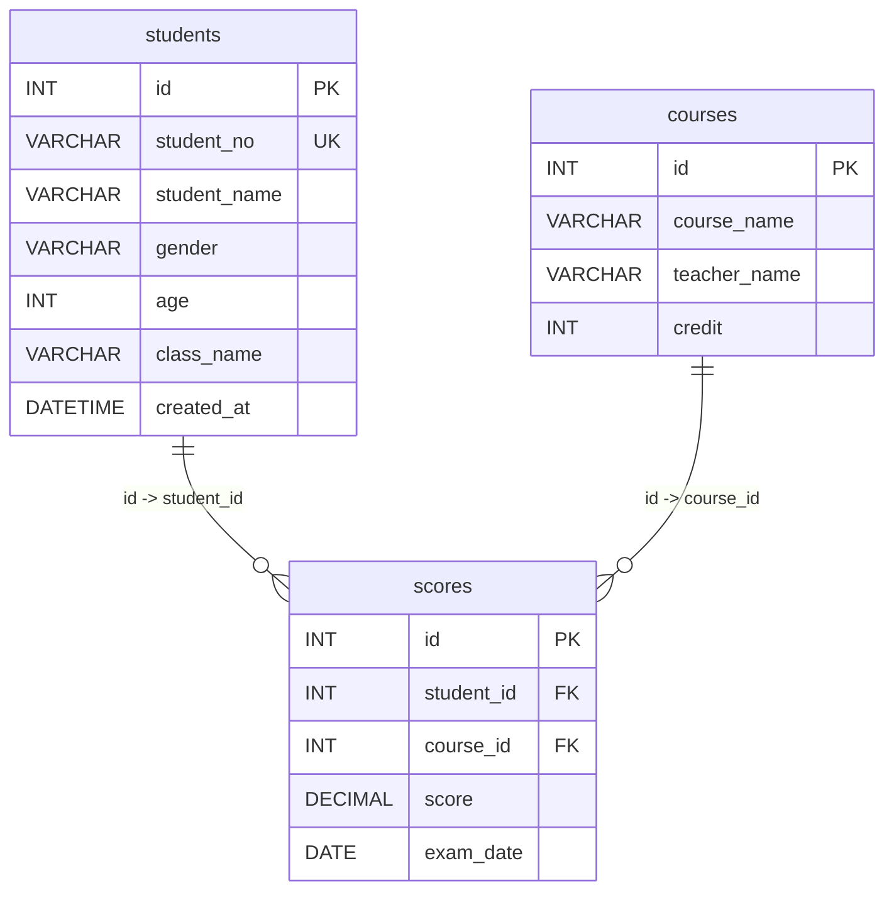

# 学生管理系统 ER 图

这份文档用来帮助你快速看懂本仓库核心案例的表关系。

如果你在写多表查询时总觉得容易绕，可以先回来看这张图，再去写 `JOIN`。

## 1. 表关系图

## 2. 三张表各自负责什么

### students

这张表保存学生基本信息，例如：

- 学号
- 姓名
- 性别
- 年龄
- 班级

### courses

这张表保存课程基本信息，例如：

- 课程名
- 老师名
- 学分

### scores

这张表保存“学生和课程之间的成绩关系”，例如：

- 哪个学生
- 哪门课程
- 考了多少分
- 哪天考试

所以它是多表查询里最关键的一张表。

## 3. 为什么 scores 是中间桥梁

如果你只看 `students`，你知道“有哪些学生”；
如果你只看 `courses`，你知道“有哪些课程”；
但你还不知道“哪个学生学了哪门课，考了多少分”。

这部分信息正是通过 `scores` 来补上的。

所以当你要查下面这类结果时，通常都要经过 `scores`：

- 学生姓名 + 课程名称 + 分数
- 每个学生的平均分
- 每门课程的最高分
- 每个班级的平均分

## 4. 初学者写多表查询前建议先做这三步

1. 先圈出要显示的字段分别在哪张表
2. 再确定表和表之间靠什么字段连接
3. 最后再决定是写明细查询还是统计查询

## 5. 推荐搭配阅读

- [docs/chapters/02-create-database-and-tables.md](/Users/zhouwenjing/Documents/WorkTransfer/MySQL-Stu/docs/chapters/02-create-database-and-tables.md)
- [docs/chapters/05-group-by-and-join.md](/Users/zhouwenjing/Documents/WorkTransfer/MySQL-Stu/docs/chapters/05-group-by-and-join.md)
- [sql/10-join.sql](/Users/zhouwenjing/Documents/WorkTransfer/MySQL-Stu/sql/10-join.sql)
